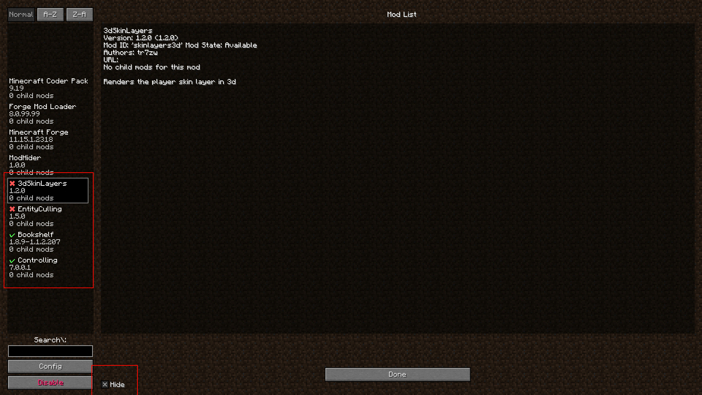

# ModHider

A Forge 1.8.9 mod that aims to hide unwanted mods from being sent to the server.

This works by modifying a packet sent by Forge, which contains your mod list. You can choose to remove some mods from
this list, directly inside the mod list.

## Why?

Some servers disallow some modifications (like Hypixel with Freelook mods, even tho it doesn't change much to people's
life), and I think that is a bad idea.

This mod let's you revert that, by hiding it from the server, and tho letting you play with it.

## Why can't Forge, FML, MCP and ModHider be hidden?

Forge, FML, and MCP are by default in Forge. To keep this mod undetected, it prevent users from modifying the visibility
of these components.

ModHider is hidden by default, it would be dumb for you to hide a "disallowed" mod, but not this one...